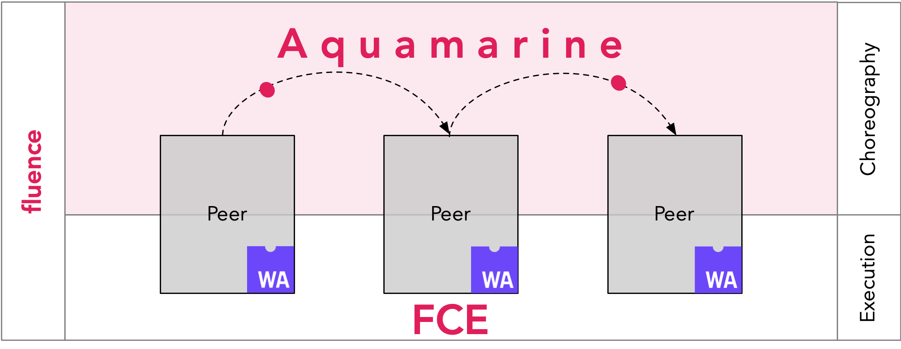

# fldist is deprecated. Install aqua to work with aqua code and service management.
# https://doc.fluence.dev/aqua-book/getting-started/installation


# Fluence proto-distributor
[](https://www.npmjs.com/package/@fluencelabs/fldist)

Tool to manage services on & interact with the Fluence Network

## About Fluence

Fluence is an open application platform where apps can build on each other, share data and users

|         Layer         |                                                               Tech                                                                |              Scale               |               State               |                                                   Based on                                                    |
| :-------------------: | :-------------------------------------------------------------------------------------------------------------------------------: | :------------------------------: | :-------------------------------: | :-----------------------------------------------------------------------------------------------------------: |
|       Execution       |                                             [FCE](https://github.com/fluencelabs/fce)                                             |           Single peer            | Disk, network, external processes | Wasm, [IT](https://github.com/fluencelabs/interface-types), [Wasmer\*](https://github.com/fluencelabs/wasmer) |
|      Composition      |                                      [Aquamarine](https://github.com/fluencelabs/aquamarine)                                      |          Involved peers          |      Results and signatures       |                                                 ⇅, π-calculus                                                 |
|       Topology        | [TrustGraph](https://github.com/fluencelabs/fluence/tree/master/trust-graph), [DHT\*](https://github.com/fluencelabs/rust-libp2p) | Distributed with Kademlia\* algo |    Actual state of the network    |                                [libp2p](https://github.com/libp2p/rust-libp2p)                                |
| Security & Accounting |                                                            Blockchain                                                             |          Whole network           |        Licenses & payments        |                                                  substrate?                                                   |



## Installation

With npm

```bash
npm install -g @fluencelabs/fldist
```

With yarn

```bash
yarn global add @fluencelabs/fldist
```

## Usage

See [usage](doc/USAGE.MD)

## Contributing

While the project is still in the early stages of development, you are welcome to track progress and contribute. As the project is undergoing rapid changes, interested contributors should contact the team before embarking on larger pieces of work. All contributors should consult with and agree to our [basic contributing rules](CONTRIBUTING.md).

## License

[MIT](LICENSE)